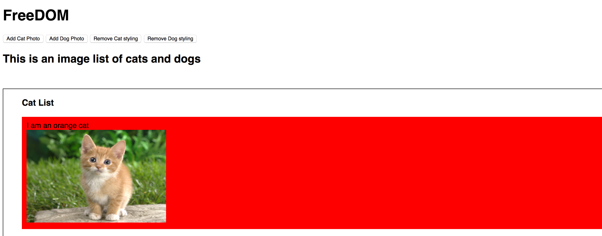

# FreeDOM

## About
FreeDOM is a custom library with methods to select certain HTML elements as well as execute specific functions. By using this library and the Giphy API, users can see a sample of endearing cat and dog photos along with fun GIFs from the latter.

## Instructions
To use FreeDOM, please clone or download this repository and open `index.html`. Make sure to run webpack with the output file `freeDOM.js`. From there, you will have access to several buttons, two of which add a GIF of either cats or dogs as well as remove the styling on the current list of photos for each respective animal.

## API

In addition, any of the methods below can be used in the console to manipulate and traverse the DOM:

`$l`

Traversing the DOM

- `children`
- `parent`

DOM Manipulation

- `html`
- `empty`
- `append`
- `remove`
- `attr`
- `addClass`
- `removeClass`

Event Listeners

- `on`
- `off`

`$l.ajax`

By utilizing the `$l` global variable, HTML elements can be wrapped in a `DOMNodeCollection`, providing access to all the methods in FreeDOM.

`$l` can be used in multiple variations to make DOM traversal and manipulation easier
- `$l` is used to select elements with a certain CSS styling. For example, `$l("div")` will return a `DOMNodeCollection` object
- `$l` also can wrap `HTMLElement`s to provide access to all the FreeDOM methods to the elements
- `$l` is able to take strings and build an `HTMLElement` out of it, then wrap it as a `DOMNodeCollection` object to use the library's methods
- `$l` has the ability to queue all callbacks and run them once the component is loaded

`children` - Returns a `DOMNodeCollection` of all direct children in the original `DOMNodeCollection`

`parent` - Returns a `DOMNodeCollection` of all unique parents based on the original `DOMNodeCollection`

`html` - Returns the `innerHTML` element of the first element in the `DOMNodeCollection`. If a string is supplied as an argument, all elements in the `DOMNodeCollection` will have a new `innerHTML` element based on the string.

`empty` - Removes the `innerHTML` element of all elements in the `DOMNodeCollection`

`append` - Takes a string or `HTMLElement` and appends it to each element in the collection

`remove` - Iterates over the `DOMNodeCollection`, removing each element from the DOM

`attr` - Takes a key and optional value, where it returns the current value of the key for the first DOMNode element if no value argument is supplied, or reassigns the key's value based on the value argument provided. The latter applies to all elements in the `DOMNodeCollection`

`addClass` - Adds the class provided as an argument to all elements in the `DomNodeCollection`

`removeClass` - Removes the class provided as an argument to all elements in the `DOMNodeCollection`

`on` - Adds an event listener to each element with the callback provided

`off` - Removes the event listener for each element

`$l.ajax` - Sends an HTTP request based on an options hash object provided. Keys in the object include:
- method
- url
- data
- contentType
- success
- error
